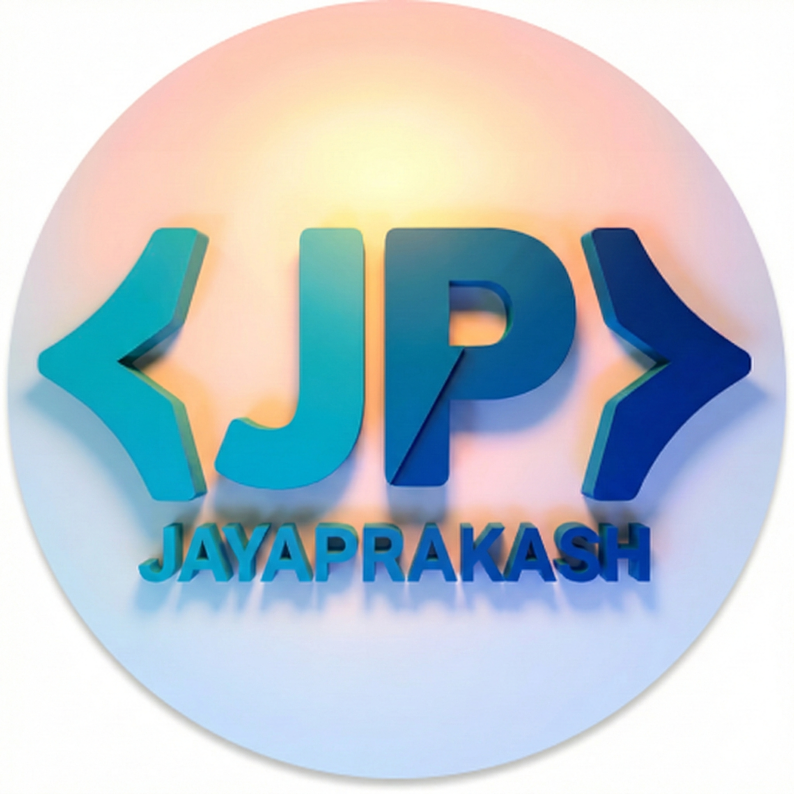

<div align="center">



# ✨ JAYAPRAKASH A.R. — Personal Portfolio

### 🤖 AI & LLM Developer &nbsp;|&nbsp; 🌐 Full-Stack App Developer

[](https://github.com/jayaprakash2207)
[](https://www.linkedin.com/in/jayaprakash2005/)
[](https://x.com/jayaprakash_x7)
[](mailto:jayaprakash22072005@gmail.com)

</div>

---

## 🚀 About the Project

A **futuristic, responsive personal portfolio website** built with pure HTML5, CSS3, and JavaScript. It features:

- 🎥 **Immersive video backgrounds** (galaxy, blackhole, hero animations)
- 🌌 **Glassmorphism UI** with backdrop-blur and gradient accents
- ✨ **Scroll-driven animations** using CSS `animation-timeline: view()`
- 📱 **Fully responsive** layout for desktop, tablet & mobile
- 🎠 **Auto-scrolling tech-stack slider** with pause-on-hover
- 🗂️ **Sidebar mobile navigation** with open/close animations

---

## 👨‍💻 About Me

> *"AI-Focused Developer specializing in LLMs, Neural Networks, Machine Learning, and Deep Learning. Also skilled in building impactful Web & App solutions with a strong interest in Data Science and intelligent systems."*

I'm a **B.E. student** building strong expertise in AI and LLMs while working as a full-stack developer using **Angular**, **React**, and **Spring Boot** to craft intelligent, scalable, and user-focused solutions.

---

## 🛠️ Tech Stack

### 🤖 AI / ML


### 🌐 Web / Full-Stack


---

## 📁 Projects

### 1. 😄 Facial Emotion Detection
> A **MATLAB-based** project that identifies human emotions from facial expressions using image processing and machine learning techniques.

- Detects faces from images or live video streams
- Classifies emotions: **Happy**, **Sad**, **Angry**, **Surprise**
- Uses MATLAB's **Computer Vision Toolbox** and built-in classifiers

[](https://github.com/jayaprakash2207/Facial-Emotion-Detection)

---

### 2. 🌐 Modern Portfolio Website
> A **responsive and visually engaging portfolio** designed using modern web technologies.

- Built with **HTML5**, **CSS3**, and **JavaScript**
- Mobile-optimized with smooth scroll animations
- Futuristic glassmorphism design with video backgrounds

---

### 3. 🔐 OTP Based Smart Wireless Locking System
> A **smart IoT security solution** for homes and offices using OTP authentication.

- Generates a unique **One-Time Password** per access attempt
- Uses **wireless communication** to control digital door locks
- Built with **Arduino** and IoT hardware

[](https://github.com/jayaprakash2207/OTP-BASED-SMART-WIRELESS-LOCKING-SYSTEM-USING-ARDUINO)

---

## 🗂️ Repository Structure

```
PORTFOLIO/
├── index.html        # Main HTML — sections: Hero, About, Projects, Skills, Contact
├── style.css         # Styles — glassmorphism, animations, responsive breakpoints
├── app.js            # JavaScript — sidebar toggle, project hover interactions
├── images/           # Static images (logo, grid cards, skill icons, digital brain)
└── videos/           # Background & project demo videos
```

---

## ⚡ Features Highlight

| Feature | Details |
|---|---|
| 🎥 Video Backgrounds | Galaxy & blackhole looping MP4s with `mix-blend-mode` |
| 🌊 Scroll Animations | CSS `animation-timeline: view()` blur, fade, slide effects |
| 🎠 Skills Slider | Auto-running infinite carousel with pause on hover |
| 📬 Contact Form | Full Name, Email, Message fields with focus highlights |
| 📱 Mobile Sidebar | Animated open/close sidebar for small screens |
| 🎨 Gradient Text | Animated flowing gradient across headings & accents |

---

## 🏃 Getting Started

No build step required — it's pure HTML/CSS/JS.

```bash
# Clone the repository
git clone https://github.com/jayaprakash2207/PORTFOLIO.git

# Open in your browser
open index.html
# or just double-click index.html
```

> **Tip:** Use a local server (e.g. VS Code Live Server) for the best experience with video autoplay policies.

---

## 📬 Contact

| Platform | Link |
|---|---|
| 📧 Email | [jayaprakash22072005@gmail.com](mailto:jayaprakash22072005@gmail.com) |
| 💼 LinkedIn | [linkedin.com/in/jayaprakash2005](https://www.linkedin.com/in/jayaprakash2005/) |
| 🐦 Twitter / X | [@jayaprakash_x7](https://x.com/jayaprakash_x7) |
| 🐙 GitHub | [github.com/jayaprakash2207](https://github.com/jayaprakash2207) |
| 📞 Phone | +91 82481 86839 |

---

<div align="center">

**Copyright © Jayaprakash A.R.** — Built with ❤️ using HTML · CSS · JavaScript

</div>
